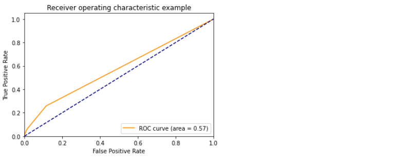

# Supervised Machine Learning Model Integration Using Flask (Project-4):

## Heroku Deployment:

[Heroku Deployment](https://ml-outcome-prediction-heroku.herokuapp.com/)

## Tebleau Visual Analytics:

Tableau visual analysis is prepared and published using 'Tableau Public'. The visuals are also embeded in the website. Below is the link to access 'Tableau Public'.

[Tableau Visual Analysis](https://public.tableau.com/app/profile/mubashira.qari/viz/Stop_Frisk_Analysis/Story2?publish=yes)

## Data Source:

- Data records from the NYPD Stop, Question, and Frisk database are available for download from the links provided below. Data is made available in CSV format.

[NYPD-Datasets](https://www1.nyc.gov/site/nypd/stats/reports-analysis/stopfrisk.page)

## Problem Worth Solving, Analyzing, and Visualizing:

1- ‘Stop, Question, and Frisk’ database has multiple features which are important in affecting the outcome. The aim of this machine learning project is to predict, whether the summons is issued or not for the suspect.

2- Also to find out which features, mostly contribute to the arrest of the suspect.

## Implementation:

- The project implementation is done using Scikit-learn library in machine learning, along with the following.

1- Python Pandas
2- Flask Web Framework
3- Python Matplotlib
4- HTML/CSS/Bootstrap
5- JavaScript D3.js
6- SQL Database
7- Tableau
Host application using Heroku or amazon cloud for deployment 

## Exploratory Data Analysis (EDA):

- The 2017, 2018 and 2019 ‘Stop, Question and Frisk’ datasets are merged together to perform the preprocessing steps and prepare for the  training dataset.

- The 2020 ‘Stop, Question and Frisk’ dataset  is retrieved to perform the preprocessing steps and prepare for the  testing dataset.

## Data Preprocessing (ETL):
- Import the dependencies
- Loading the dataset from the resources folder
- Merging 2017,18, &19 for training data and keeping 2020 for testing
- Removing unwanted text from columns
- Find null values
- Function checking for missing values
- Generate our categorical variable lists
- Check the number of unique values in each column

- Convert time into seconds to have integer values for machine learning
- Replacing the text strings with zeros in the integer columns
- Replacing two different category names with one category
- Removing special characters from the values
- Rename the columns
- Dropping columns which are not playing any role in the feature importances of the datasets
- Converting to correct data type
- Transform 'Summons Issued' outcome column into binary
- Binning of categories in columns is performed
- Files are saved as a csv files for further applications of data

- Converting categorical data to numeric using Label Encoder for unhirarchial data value columns
- Convert categorical data to numeric and separate target feature for training data using - - get_dummies encoding method for the entire dataframe
- Scaling the data by using the StandardScaler() function 
- Assigning first the outcome as: SUMMONS_ISSUED_FLAG 
- Logistic Model fitting
- Random Forest Classifier fitting
- Fitting Different Models on Imbalance Data for Optimization
- Import an Extremely Random Trees classifier
- Import an Adaptive Boosting classifier
- Applying K-nearest neighbors

## Now preparing to fit the models and analyze the results:

## Analysis for Summons Predictions:

- Actual: 0's and 1's are:[
- Summons Issued (NO)  - 0's -  35056 
- Summons Issued (YES)  - 1's -   1040

- Prediction:
- True negative (tn) = 9281 ;which means model is correctly predicted 9281 -- 0's
- False negative (fn) = 263 ;which means model is incorrectly predicted 0's
- True positive (tp) = 0 ; which means model is not correctly predicting 1's at all
- False positive (fp) = 0 ; which means model is not predicting 1's at all which is good in away that it is not incorrectly predicting 1's 

- we want higher true positives and lower false positives

- array [9281,    0],
-       [ 263,    0]

- Accuracy: 0.9724434199497066

- How accurate is "Accuraracy"?

- Even a model with relatively high accuracy can run into problems if used on an imbalanced data.
- tn, fp, fn,  tp are weighted based on how the data is distributed.
- When we look at our actual data distribution, we can clearly see that the number of 0's are way higher than 1's and we conclude that we have an imbalance dataset.

- Instead of a pure binary output, the KNN model also has a predict_proba() method, which returns probability estimates for given input.

- The receiver operating characteristic (ROC) curve helps us visualize this tradeoff. The false positive rate and the true positive rate are calculated for several thresholds, and we plot them against each other.

- Resampling Techniques for Imbalance Data: Over-sampling: SMOTE:

## Now Assigning Another outcome for Prediction: 'SUSPECT_ARRESTED_FLAG'  and repeat the  steps:

## Analysis for Arrest Prediction:

- Actual: 0's and 1's are:
- Suspect Arrest (NO)- 0's  -  25212
- Suspect Arrest (Yes)- 1's   -  10884
- Name: SUSPECT_ARRESTED_FLAG

- Prediction:
- True negative (tn) = 5515 ;which means model is correctly predicted 5515 -- 0's
- False negative (fn) = 1189 ;which means model is incorrectly predicted 0's
- True positive (tp) = 2368 ; which means model is correctly predicting 2368 --1's 
- False positive (fp) = 472 ; which means model is incorrectly predicting 472 --1's  

- we want higher true positives and lower false positives

- array [5515,  472],
-     [1189, 2368]

- Accuracy: 0.8259639564124057

## Feature Impotances For Summons Issued Outcome:

## Feature Impotances For Suspect Arrest Outcome:

## Conclusion:

- In machine learning algorithm, a model which gives the best overall results with regards to the goal, should be selected.

- When dealing with the imbalance data, resampling methods should be applied carefully, keeping in mind the goal to be achieved.

- Feature selection should be examined carefully.

- Target/outcome column value count should be evaluated.

## Flask Application:

- The model is saved using joblib and retrieved in the Flask application for the prediction.

- The following code files are prepared for performing the process:

## PostgreSQL Database:

- The cleaned merged training data and 2020 testing data are imported in the PosgreSQL 'stop_frisk_db' database for further analysis.

